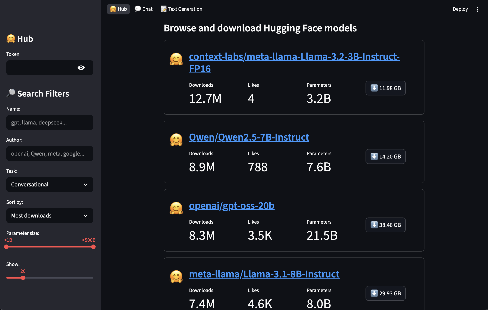
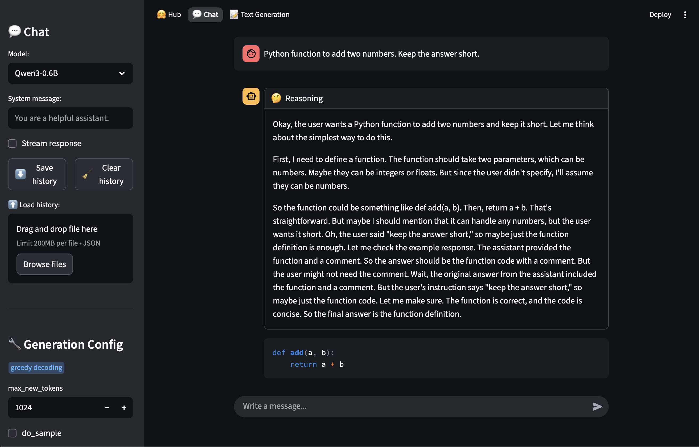
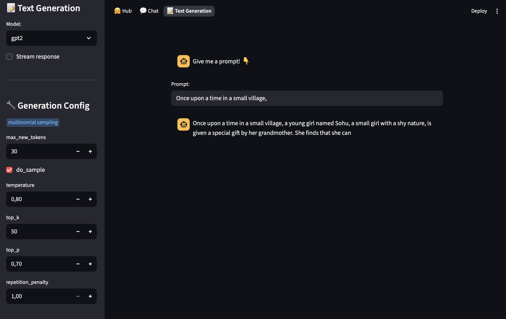

# huggingface-models-playground
A **Streamlit app** to interactively generate text using **Hugging Face Transformers** (GPT-2 or any other compatible model).

---

## Features

- 🔎 Search and 📥 Download Hugging Face models.
- 💬 Chat and generate text using any Hugging Face model.
- 🔧 Adjustable generation parameters:
  - `max_new_tokens`
  - `temperature`
  - `top_k` and `top_p` sampling

---

## Hub



## Chat



## Text Generation



---

## Installation

1. Clone the repository:

```bash
git clone https://github.com/lor811/huggingface-models-playground.git
cd huggingface-models-playground
```
2. Create virtual environment and install dependencies

- On macOS:

```bash
python3 -m venv venv
source venv/bin/activate
pip install -r requirements.txt
```
- On Windows:

```bash
python -m venv venv
.\venv\Scripts\Activate.ps1
pip install -r requirements.txt
```

**Note**: installation of `torch` with CUDA support via pip is **not guaranteed**. More informations on the [PyTorch website](https://pytorch.org/get-started/locally/).

3. Run streamlit app
```bash
streamlit run App.py
```